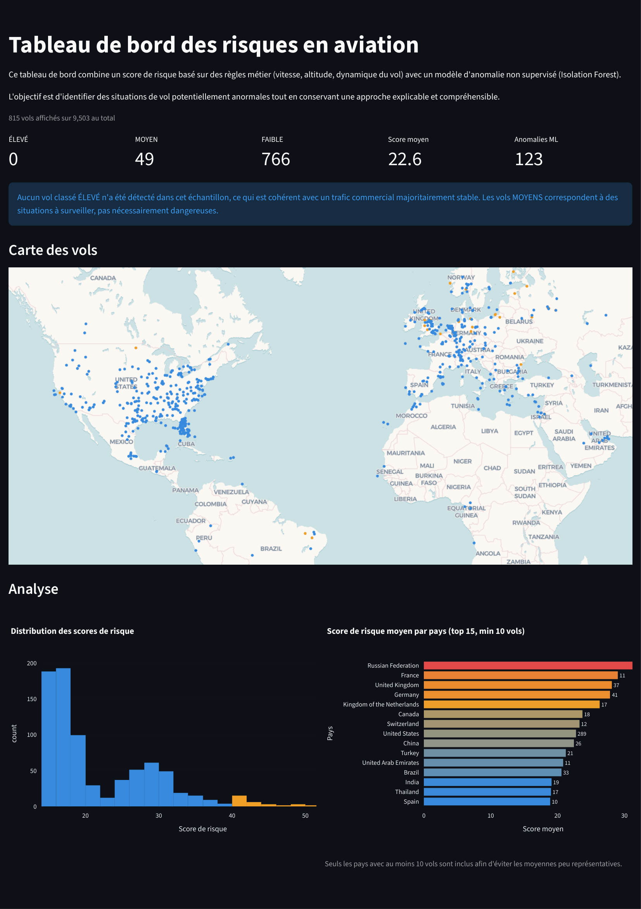
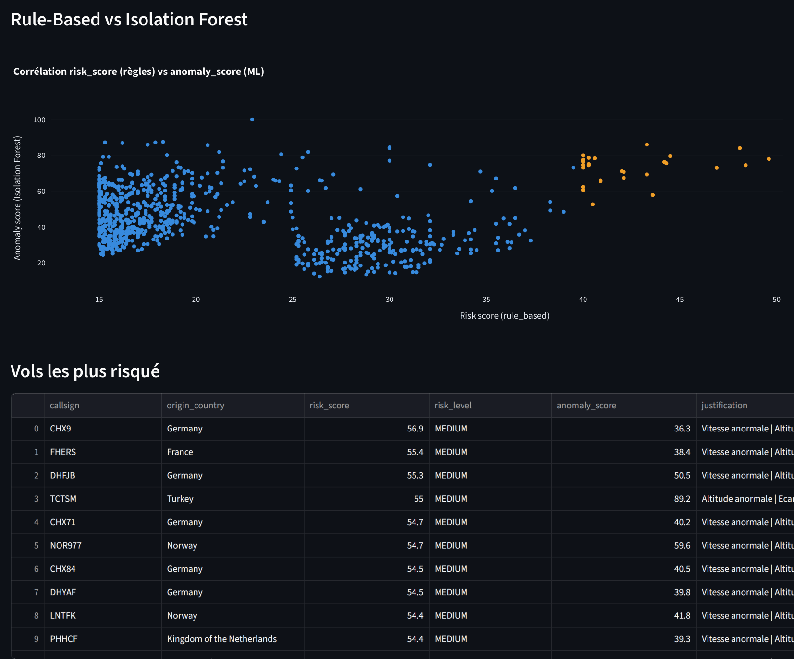

# Aviation Risk — Détection d'anomalies de vol en temps réel


Projet Data Science de bout en bout : ingestion de données de trafic aérien en temps réel via l'API OpenSky, scoring de risque explicable basé sur des règles physiques, benchmark avec un modèle ML non supervisé (Isolation Forest), et visualisation sur un dashboard interactif.

---

## Dashboard

**Lien vers le dashboard** : https://aviation-risk-v2.streamlit.app/




---

## Architecture

```
aviation-risk-v2/
│
├── data/
│   ├── raw/                  # Données brutes OpenSky (.csv horodatés)
│   └── processed/            # Données nettoyées, features, scores
│
├── src/
│   ├── ingestion/
│   │   └── fetch.py          # Appel API OpenSky + sauvegarde
│   ├── preprocessing/
│   │   └── clean.py          # Nettoyage, typage, gestion des nulls
│   ├── features/
│   │   └── engineer.py       # Feature engineering (vitesse, altitude, position)
│   └── scoring/
│       └── risk_score.py     # Score de risque explicable (rule-based)
│
├── models/
│   ├── detector.py           # Isolation Forest (benchmark ML)
│   ├── isolation_forest.pkl
│   ├── scaler.pkl
│   └── features_used.pkl
│
├── dashboard/
│   └── app.py                # Dashboard Streamlit interactif
│
├── requirements.txt
└── README.md
```

---

## Pipeline de données

```
OpenSky API
    │
    ▼
fetch.py          →  data/raw/opensky_TIMESTAMP.csv
    │
    ▼
clean.py          →  data/processed/clean.csv
    │                (suppression on_ground, nulls, typage, timestamps)
    ▼
engineer.py       →  data/processed/features.csv
    │                (speed_kmh, altitude_diff, vertical_rate_abs, lat/lon bins)
    ▼
risk_score.py     →  data/processed/scored.csv
    │                (risk_score 0-100, risk_level, justification)
    ▼
detector.py       →  data/processed/benchmark.csv
    │                (anomaly_score IF, anomaly_flag, accord 98.1%)
    ▼
app.py            →  Dashboard Streamlit
```

---

## Approche technique

### Score de risque explicable (rule-based)

Plutôt que d'appliquer directement un modèle ML, j'ai d'abord construit un score de risque basé sur des contraintes physiques du domaine aérien :

| Règle | Poids | Logique |
|---|---|---|
| Vitesse anormale | 25% | < 100 km/h ou > 1 200 km/h |
| Altitude anormale | 25% | < 0m ou > 13 000m |
| Taux vertical extrême | 20% | > 50 m/s |
| Écart baro/géo élevé | 15% | Variable continue normalisée |
| Variation verticale forte | 15% | Variable continue normalisée |

Chaque vol reçoit un score entre 0 et 100 et une justification lisible : `"Vitesse anormale | Altitude anormale"`.

### Benchmark Isolation Forest

L'Isolation Forest est entraîné sur les signaux bruts (sans les flags rule-based) pour valider indépendamment les anomalies détectées.

**Résultat : 98.1% d'accord entre les deux approches** sur 9 503 vols analysés. Les 1.9% de divergences sont les cas les plus intéressants — ils révèlent des patterns que les règles physiques ne capturent pas.

---

## Stack technique

| Catégorie | Outil |
|---|---|
| Langage | Python 3.11 |
| Données | pandas, numpy |
| ML | scikit-learn (Isolation Forest, StandardScaler) |
| Visualisation | Plotly, Streamlit |
| API | OpenSky Network (REST, données temps réel) |
| Sérialisation | joblib |

---

## Lancer le projet

```bash
# 1. Cloner le repo
git clone https://github.com/ton-username/aviation-risk-v2
cd aviation-risk-v2

# 2. Installer les dépendances
pip install -r requirements.txt

# 3. Lancer la pipeline complète
python src/ingestion/fetch.py
python src/preprocessing/clean.py
python src/features/engineer.py
python src/scoring/risk_score.py
python src/models/detector.py

# 4. Lancer le dashboard
streamlit run dashboard/app.py
```

---

## requirements.txt

```
requests
pandas
numpy
scikit-learn
streamlit
plotly
joblib
```

---

## Ce que j'ai appris

- Construire une pipeline de données complète de l'ingestion jusqu'à la visualisation
- L'importance du **feature engineering métier** : encoder des contraintes physiques du domaine avant d'appliquer du ML
- Pourquoi un **score explicable** est souvent plus utile qu'un modèle boîte noire, surtout dans des domaines à enjeux
- La différence entre un modèle qui **tourne** et un modèle qui **tient en production** (gestion des nulls, guards, timeout, reproductibilité)

---

## Limites et pistes d'amélioration

- Les données OpenSky peuvent contenir des erreurs de capteur — certaines anomalies détectées sont des artefacts
- Le scoring rule-based repose sur des seuils fixes, calibrables selon le contexte
- Piste : enrichir avec des données météo pour contextualiser les anomalies d'altitude
- Piste : programmer l'ingestion toutes les 30 minutes pour un tableau de bord en temps réel.

---

*Données : [OpenSky Network](https://opensky-network.org/) — open data, usage non commercial*